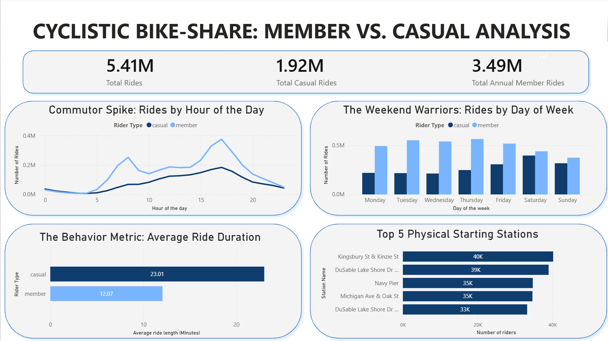

# 🚲 Cyclistic Bike-Share: Converting Casual Riders into Annual Members
### Google Cloud BigQuery • SQL • Power BI

---

## 📊 Dashboard

---

## 📌 Project Overview

Cyclistic's business objective is to convert casual riders into annual members. This project analyzes **5.41 million bike trips** to identify behavioral differences between rider segments and develop data-driven membership conversion strategies using **Google Cloud BigQuery** and **Power BI**.

**Raw Data → BigQuery → Feature Engineering → Power BI Dashboard → Business Recommendations**

---

## 🗂 Dataset

Source: Cyclistic Historical Trip Data (Divvy Bike Share / Google Data Analytics Capstone)

- 12 months of ride data
- 5.41 million bike trips
- Casual Riders and Annual Members
- Ride timestamps, bike types, station information, and trip durations

---

## 🎯 Business Question

**How can Cyclistic convert more casual riders into annual members?**

---

## 📈 Key Insights

### 1️⃣ Members Ride for Transportation

- Ride activity peaks around **8:00 AM** and **5:00 PM**
- Strong weekday commuter patterns
- Consistent usage throughout the work week

### 2️⃣ Casual Riders Ride for Leisure

- Highest activity on **Friday, Saturday, and Sunday**
- Usage patterns suggest recreational riding
- Less structured ride schedules compared to members

### 3️⃣ Casual Riders Take Longer Trips

| Rider Type | Average Ride Duration |
|------------|----------------------|
| Casual | 23.01 Minutes |
| Member | 12.07 Minutes |

- Casual riders spend nearly twice as much time per ride

### 4️⃣ Bike Type Preferences

- Casual riders show a stronger preference for electric bikes
- Members display a more balanced bike-type distribution

### 5️⃣ Popular Casual Rider Stations

Top physical stations include:

- Kingsbury St & Kinzie St
- Navy Pier
- DuSable Lake Shore Drive

These stations represent high-value opportunities for targeted membership campaigns.

---

## 💡 Recommendations

- Launch a **Weekend Membership Plan** tailored to recreational riders
- Offer **member-exclusive e-bike incentives**
- Deploy marketing campaigns at high-traffic casual rider stations
- Launch conversion campaigns before peak summer demand
- Highlight annual membership savings for frequent recreational riders

---

## ⚙️ Data Pipeline

### 1️⃣ Data Aggregation

- Combined 12 monthly datasets into a centralized BigQuery table
- Standardized schema across all source files

📂 View SQL file:  
👉 [01_data_aggregation.sql](sql_scripts/01_data_aggregation.sql)

---

### 2️⃣ Data Cleaning

- Removed invalid and maintenance rides
- Standardized formats for analysis
- Optimized dataset for reporting

📂 View SQL file:  
👉 [02_data_cleaning.sql](sql_scripts/02_data_cleaning.sql)

---

### 3️⃣ Feature Engineering

- Created ride duration metrics
- Generated hourly, daily, and monthly attributes
- Built fields required for dashboard analysis

📂 View SQL file:  
👉 [03_feature_engineering.sql](sql_scripts/03_feature_engineering.sql)

---

## 🛠 Tools & Skills Demonstrated

### Tools

- Google Cloud BigQuery
- SQL
- Power BI
- Power Query
- DAX
- Git & GitHub

### Skills

- Data Cleaning & Transformation
- Large-Scale Data Processing
- Feature Engineering
- Dashboard Development
- Business Intelligence Reporting
- Customer Behavior Analysis
- Data Storytelling
- Stakeholder-Focused Recommendations

---

## 💼 Why This Project Matters

This project demonstrates the ability to:

- Transform raw data into business insights
- Design stakeholder-focused dashboards
- Convert analytical findings into actionable recommendations
- Process multi-million-row datasets using cloud infrastructure
- Build scalable analytics workflows in BigQuery

---
